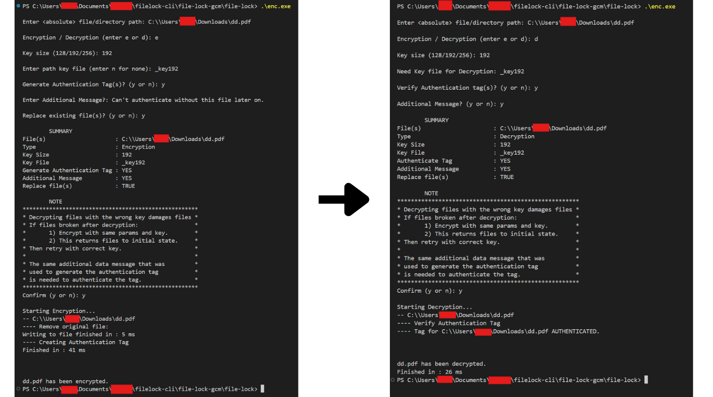

# :lock: **file-lock**  

<br>
<br>

## :page_with_curl: **Program Description**

**file-lock** is a simple CLI tool to **encrypt** and **decrypt** files or directories using AES.
Now featuring **AES-NI hardware acceleration** and **parallel processing** for **significantly faster performance** on supported CPUs.

<br>
<br>

## :book: **Features**

- Works on **single files** and **directory trees**.
- uses **AES-NI intrinsics** for faster encryption (not all CPUs)
- **Parallel file encryption** dramatically speeds up bulk directory encryption
- Any file types
- Optional Authentication Tags

<br>
<br>

## :key: **Key Generation**

- The key generation is **cryptographically secure**
- **Caution** : Too many key generations in a short time --> process can time out.

<br>
<br>

## :warning: **Important Details**

Always follow the following guidelines:

- **Run at least one test round before applying on real data**.  
  To ensure program functions properly

- **Decrypted files will always replace the ciphertext files**.  
  Ensure that you have backups of any important data before performing decryption.

- **Authentication Tags and Additional Message File are always deleted when verified**.  
  For security reasons, it's best to destroy these tags after authentication.
  
- **Do not try to open the key file**.  
  This can corrupt the file and make decryption impossible.

<br>
<br>

### :book: **Tutorial**

Getting started with **file-lock**:

```bash
# Clone project
git clone git@github.com:constantin9845/file-lock.git

cd file-lock/

# Compile
make

```

<br>

Run program 
```bash
./enc #linux/mac

.\enc.exe #windows
```

<br>

Directory example
```bash
# To encrypt everything inside the 'tree1' directory (including all subdirectories):

# Linux/Mac
./enc /home/username/Documents/tree1/*


# Windows
.\enc C:\\Users\username\Documents\tree1\
```

<br>




<br>
<br>


## :warning: **Disclaimer**

By using this program, you acknowledge and agree to the following:

- The author is **not responsible** for any **damaged files** or **data loss** that may occur during encryption or decryption.
- It is **your responsibility** to ensure that all files and directories are correctly backed up before performing encryption.
- The program is provided **as-is**, and the author makes no warranties regarding its functionality or safety.
- **Use at your own risk**. The author is not liable for any loss, damage, or other consequences arising from the use of this program.

<br>
<br>


For support or feedback, feel free to [open an issue](https://github.com/constantin9845/file-lock/issues).


