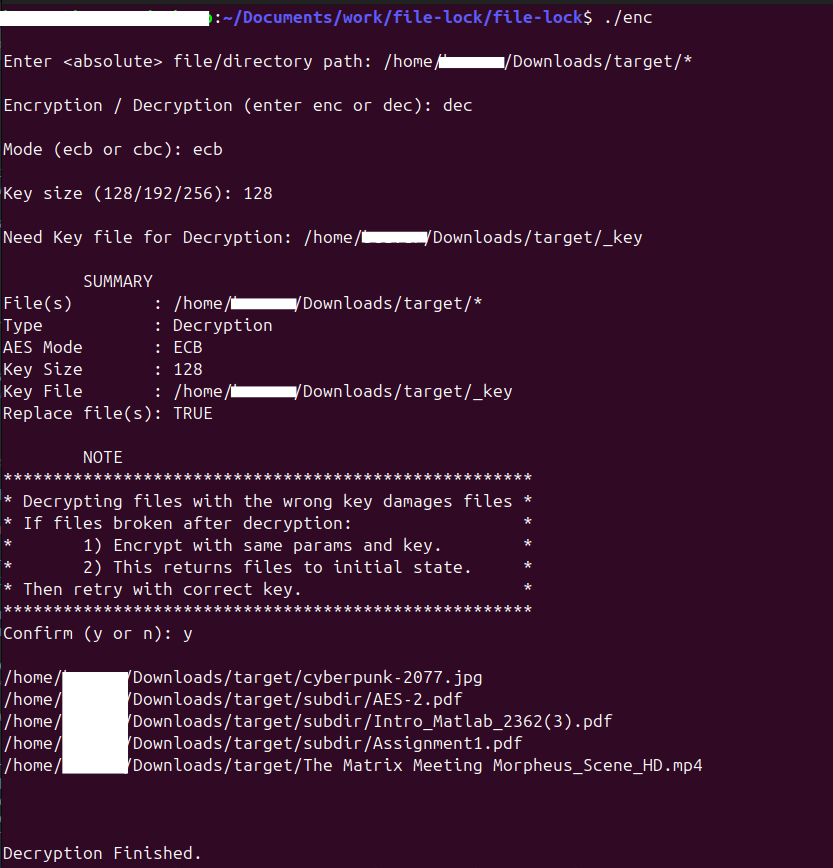

# :lock: **file-lock**  
*Encrypt individual files and directories using AES*

---

### :page_with_curl: **Program Description**

The **file-lock** program allows you to **encrypt** or **decrypt** a **single file** or a **full directory**.  

- **Encryption** can be performed using a **user-provided key**, or a new key can be generated automatically.
  - The key should be stored in a file, with **only the first 16 bytes** being used.
  - If a new key is generated, it will be saved in the `Downloads/target/` folder.

---

### :memo: **Notes**

- **Hidden files** are skipped during encryption and decryption.
- **In CBC mode**, the file size will increase by **16 bytes** after encryption due to the inclusion of the **Initialization Vector (IV)**.
  
---

### :white_check_mark: **Verified File Types**

The program supports encryption and decryption for all common file types, including:

- **PDF**
- **PNG**
- **DOCX**
- **MP4**

---

## :warning: **Caution**

Please keep the following important points in mind:

- **Decrypted files will replace the original files**.  
  Ensure that you have backups of any important data before performing decryption.
  
- **No recovery is possible** without the key used for encryption.  
  **Do not modify or lose your key file**.
  
- **Do not open** the key file directly.  
  It is recommended to set the key file to **read-only mode** for added security.

---

### :key: **Key Generation**

- The key generation process is **cryptographically secure**, ensuring that the generated key is strong and unpredictable.
- However, there are **limits** to how many keys can be generated within a short period. For **large requests** for new keys in a short timeframe, the process may time out.

---

### :book: **Guide**

- **Absolute Paths**: All file and directory paths must be **absolute**.
  - On **Linux** and **Mac**, end the directory path with `/*` (e.g., `/home/user/files/*`).
  - On **Windows**, end the directory path with a backslash (e.g., `C:\Users\user\files\`).
  
- **Key Size Matching**: Ensure the key size matches the expected size.
  - If the chosen key size is **larger** than the key file size, the program will throw an error.
  - If the chosen key size is **smaller** than the key file size, the program will use only **part of the key**.

---

### :book: **Tutorial**

Follow these steps to get started with **file-lock**:

Compile (Unix)
```bash
./run.sh
```

Compiling on Windows
```bash
# Manually compile 3 files:
# following files must be compiled:
#   (gcc) src/AES.cpp src/fileHandler.cpp src/main.cpp
```

Run program + example run
```bash
./enc
```





### :warning: **Important Security Advice**

- Always **backup your encrypted files** before attempting decryption.
- Keep your **key file secure** and **do not share** it with untrusted parties. It is vital to maintain control of the key to ensure the security of your encrypted data.

---


## :warning: **Disclaimer**

By using this program, you acknowledge and agree to the following:

- The author is **not responsible** for any **damaged files** or **data loss** that may occur during encryption or decryption.
- It is **your responsibility** to ensure that all files and directories are correctly backed up before performing encryption.
- The program is provided **as-is**, and the author makes no warranties regarding its functionality or safety.
- **Use at your own risk**. The author is not liable for any loss, damage, or other consequences arising from the use of this program.


For support or feedback, feel free to [open an issue](https://github.com/constantin9845/file-lock/issues).

